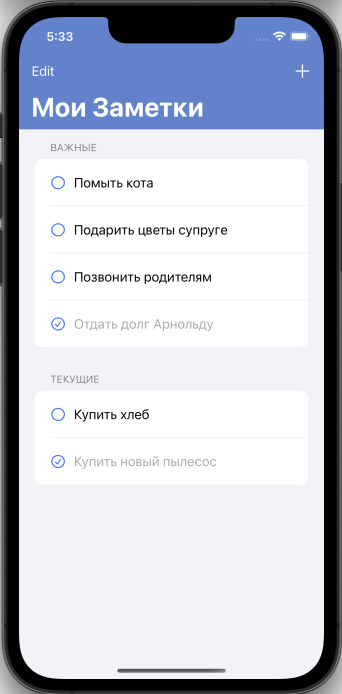
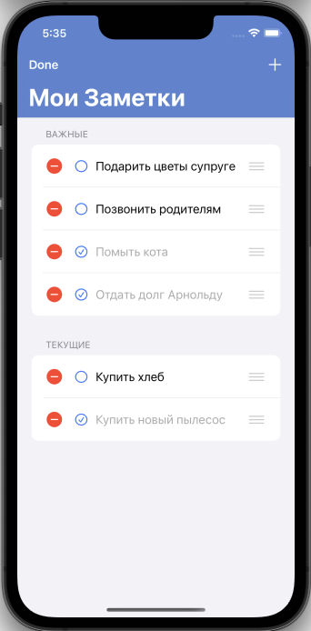
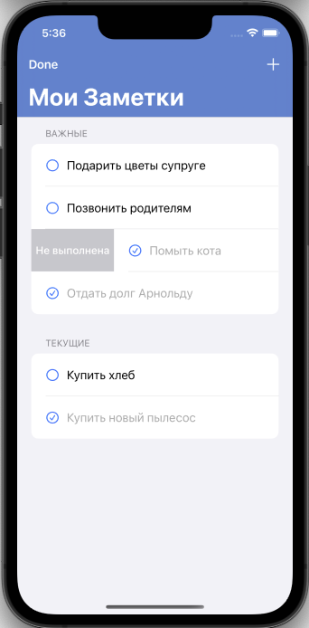
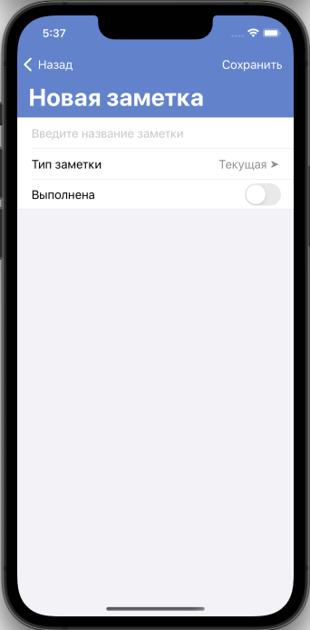
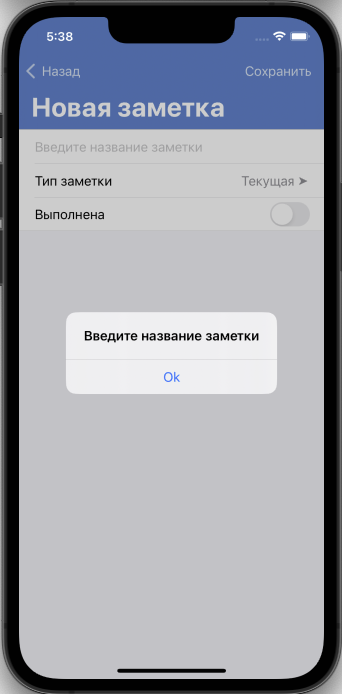
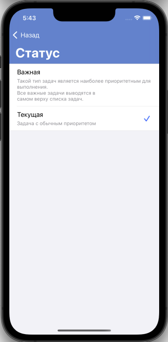

# MyNotesApp

Пользовательский интерфейс (UI) создан програмно, без использования "storyboard" и "xib".

---

На главном экране отображаются заметки пользователя
Пользователь имеет возможность:
- переместить заметку из группы "Важные" в группу "Текущие"
- изменить статус (свайп вправо) заметки "Не выполнена" на "Выполнена" и наоборот
- удалить заметку 
- добавить заметку перейдя (кнопка "+") на экран создания заметки

  

---

Экран создания заметки содержит текстовое поле, для ввода текста
Если не заполнить текстовое поле и нажать "сохранить", появится предупреждение
Пользователь может указать статус заметки а также ее тип, нажав на поле "Тип заметки"

  
